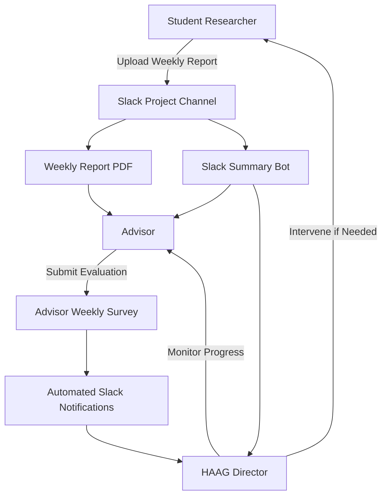

# Human-Augmented Analytics Group (HAAG)

## Progress Tracking and Evaluation System for Distributed Computational Research Teams

---

## Overview

This repository documents the design, implementation, and operational workflow of the **HAAG Progress Tracking System**, a lightweight, scalable framework for monitoring researcher contributions, team progress, and publication readiness across distributed computational research teams.

The system integrates existing research workflows (Slack, GitHub, weekly reports) with structured advisor evaluations and automated notifications to provide **transparent, fair, and timely visibility into project performance**.

This repository serves as:

* Documentation of the HAAG tracking framework
* Reference implementation for similar research groups
* Foundation for future automation (including LLM-assisted report summarization)

---

## Research Question

**How do we track how distributed research teams and projects are performing given the roles within HAAG?**

This project addresses the challenge of tracking progress across distributed, interdisciplinary research teams where work occurs across multiple platforms and institutions.

---

## Motivation and Rationale

Prior to implementing this system, HAAG relied on informal advisor check-ins and ad hoc communication, resulting in:

* Inconsistent visibility into project progress
* Delayed detection of blockers
* Uneven documentation of individual contributions
* Limited ability for leadership to intervene proactively

To address these issues, HAAG developed a structured yet lightweight system designed to provide:

* Transparency
* Fairness in evaluation
* Early detection of blockers
* Accountability across distributed teams
* Support for mentorship and advisor oversight

---

## System Architecture Overview



---

## Core Components

### 1. Weekly Student Reports

Students submit structured weekly reports documenting:

* Completed work
* Work in progress
* Blockers
* Next steps

Reports are uploaded directly to project-specific Slack channels.

**Benefits:**

* Creates a continuous historical record
* Ensures consistent documentation of progress
* Enables advisors to monitor activity asynchronously

---

### 2. Advisor Weekly Check-In Survey

Advisors submit structured weekly evaluations assessing:

| Field                   | Description                            |
| ----------------------- | -------------------------------------- |
| Advisor Name            | Faculty or project advisor             |
| Lab                     | Associated research lab                |
| Project                 | Project name                           |
| Researcher Contribution | Good / Needs Improvement / Poor        |
| Team Progress           | On Track / Needs Improvement / Blocked |
| Notes                   | Optional qualitative observations      |

This creates standardized evaluation data across all teams.

---

### 3. Automated Slack Notifications

Survey submissions trigger automated Slack notifications:

| Status            | Notification              |
| ----------------- | ------------------------- |
| On Track          | Green checkmark           |
| Needs Improvement | Yellow warning            |
| Blocked           | Alert requiring attention |

This allows leadership to quickly identify teams requiring intervention.

---

### 4. Slack-Integrated Workflow

To eliminate platform fragmentation, HAAG centralized tracking within Slack.

Previous workflow (Basecamp-based):

* Git → work
* Slack → communication
* Basecamp → reporting

New workflow:

* GitHub → research work
* Slack → reporting, communication, visibility
* Survey → structured evaluation

This removes duplicate reporting effort and improves real-time visibility.

---

### 5. Slack Report Summary Bot

A Slack bot automatically parses weekly reports and generates summaries using pattern matching.

Example extracted summary:

```
Researcher: Alice
Completed:
- Implemented data preprocessing pipeline

In Progress:
- Model training optimization

Blocked:
- Waiting for dataset access approval
```

Benefits:

* Reduces advisor review time
* Highlights blockers quickly
* Improves visibility without replacing full report review

Future versions may incorporate LLM-based summarization.

---

### 6. Automated Progress Tracking Bot

The HAAG tracking ecosystem utilizes an automation bot from the [Progress-Tracker](https://github.com/Human-Augment-Analytics/Progress-Tracker/) repository to monitor research progression across HAAG projects. 

This bot provides unified and automated visibility into technical objectives by:
* Tracking **GitHub milestones** to measure high-level research project progress across the group.
* Tracing **GitHub issues** to monitor individual task completion and progress.
* Running entirely via **GitHub Actions on a cron schedule** to automatically fetch metrics, requiring no dedicated server or maintenance overhead.

These metrics are available via the centralized [HAAG Project Tracker dashboard](https://human-augment-analytics.github.io/Progress-Tracker/), and the bot can be configured to report updates directly into project-specific Slack channels, complementing weekly student reports.

**For HAAG Leadership:**
The automated tracking system allows HAAG Leadership to maintain a high-level view of all ongoing HAAG initiatives without micromanaging individual teams. By reviewing the centralized dashboard, managers can quickly identify bottlenecks, assess resource allocation across different milestones, and ensure technical objectives align with overarching research goals before weekly advisor check-ins.

**For Project Managers:**
Project Managers can utilize the bot to track individual team progress at a granular level. By collaborating with Computational Advisors, they can establish clear project roadmaps and define specific GitHub milestones and issues that tie directly to a researcher's codebase and weekly deliverables. This ensures that every task contributes measurably to the project's milestones and provides an objective metric for evaluating researcher progress.

---

## Roles and Responsibilities

| Role               | Responsibility                                                                                       |
| ------------------ | ---------------------------------------------------------------------------------------------------- |
| Student            | Submit weekly report and update assigned GitHub issues                                               |
| Advisor            | Review reports and submit weekly evaluation                                                          |
| Project Manager    | Track individual team progress, map tasks to code, and define roadmaps with Computational Advisors |
| Slack Bot          | Summarize reports                                                                                    |
| HAAG Leadership    | Maintain high-level view via dashboard, allocate resources, and intervene                            |
| System             | Send automated notifications                                                                         |

---

## Progress Evaluation Model

### Individual Contribution Evaluation

* Good
* Needs Improvement
* Poor

### Team Progress Evaluation

* On Track
* Needs Improvement
* Blocked

This dual-layer evaluation provides both individual and team-level visibility.

---

## Outcomes and Benefits

The system has improved:

### Visibility

* Clear tracking of contributions
* Continuous progress monitoring

### Accountability

* Standardized reporting
* Structured advisor feedback

### Early Blocker Detection

* Automated alerts
* Faster leadership intervention

### Fairness

* Objective structured evaluation
* Consistent monitoring across teams

### Administrative Efficiency

* Integrated into existing workflows
* Reduced reporting overhead

---

## Lessons Learned

Key observations from deployment:

Strengths:

* Improved project transparency
* Faster response to blockers
* Better documentation of progress

Challenges:

* Survey compliance variability
* Subjectivity in qualitative notes
* Need for increased automation

Future improvements may include:

* Automated survey reminders
* LLM-based report summarization
* Dashboard visualizations
* GitHub integration for activity tracking

---

## Repository Structure

```
haag-progress-tracker/
│
├── README.md
├── docs/
│   ├── architecture.md
│   ├── workflow.md
│   ├── evaluation-model.md
│
├── examples/
│   ├── weekly-report-template.pdf
│   ├── advisor-survey-template.md
│
├── bot/
│   ├── slack-summary-bot.py
│   └── README.md
│
├── research/
│   ├── rationale.md
│   ├── lessons-learned.md
│
└── diagrams/
    └── system-architecture.md
```

---

## Scalability

The system is designed to scale across:

* Multiple labs
* Multiple institutions
* Distributed research teams
* Large interdisciplinary collaborations

---

## Connection to HAAG Research Mission

This project supports HAAG’s mission by enabling:

* Human-centered evaluation of research progress
* Transparent team performance assessment
* Improved mentorship workflows
* Fair and structured evaluation across distributed teams

---

## Future Work

Planned enhancements include:

* LLM-based automated summaries
* Real-time dashboards
* GitHub activity integration
* Automated compliance tracking
* Cross-project performance analytics

---

## How to Use This Repository

This repository can be used to:

* Deploy a similar tracking system
* Study distributed research team management
* Extend with automation and analytics tools
* Support research on human-augmented analytics workflows

---

## Authors

Human-Augmented Analytics Group (HAAG)
Georgia Institute of Technology

Contributors:
HAAG Researchers, Advisors, and Leadership

---

## License

This project is licensed for research and academic use.

---
