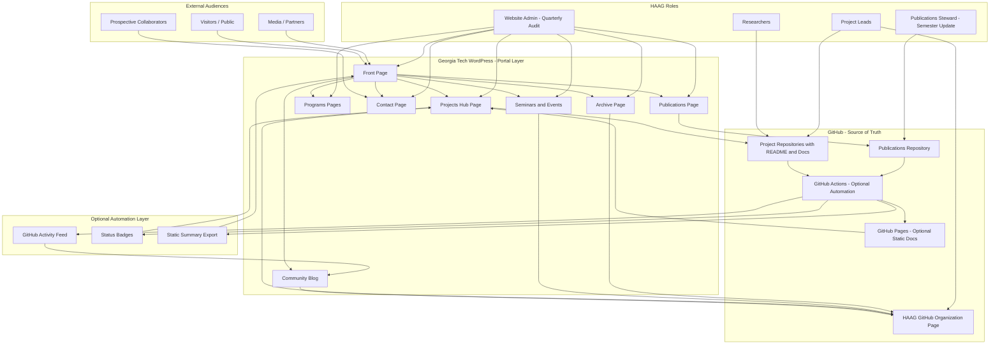

# HAAG Website Documentation & Improvement Proposal

**Human-Augmented Analytics Group (HAAG)**
Website: [https://sites.gatech.edu/human-augmented-analytics-group/](https://sites.gatech.edu/human-augmented-analytics-group/)

---

# 1. Purpose of This Document

This document:

1. Records the historical usage of the HAAG website.
2. Identifies structural and operational challenges.
3. Proposes a simplified, sustainable website governance model.
4. Recommends integration with GitHub to reduce maintenance burden.

This proposal is intended to support long-term sustainability, transparency, and visibility of HAAG’s work.

---

# 2. Platform Overview

HAAG uses the **Georgia Tech WordPress platform** for all public-facing websites.

Historically, website maintenance responsibilities were distributed across designated roles:

* **Website Manager** (project-level pages)
* **Unit Meeting Manager** (unit-level pages)

Neither role is currently active.

---

# 3. Historical Website Usage

## 3.1 Community Blog Page

**Purpose:** Highlight team milestones, achievements, and events
**First Used:** May 19, 2024
**Last Updated:** June 8, 2025

Status: Not regularly maintained.

Challenge:

* No standardized update collection process
* No defined posting cadence
* No assigned content owner

---

## 3.2 Prospective Collaborator Page

**Published:** May 2024

Purpose: Engage potential collaborators.

Status: Incomplete and unfinished.

---

## 3.3 Role-Specific Pages

Created pages for:

* Faculty & Postdoctoral Fellows
* Community Expert Affiliates
* Student Researchers
* Leadership

Example:
[https://sites.gatech.edu/human-augmented-analytics-group/faculty-affiliates-for-transdisciplinary-expansion-fate-program/](https://sites.gatech.edu/human-augmented-analytics-group/faculty-affiliates-for-transdisciplinary-expansion-fate-program/)

Status: Defunct.
No active update mechanism exists.

---

## 3.4 External Contact System

Intent: Create streamlined external contact intake through website.

Status: Never implemented.

---

## 3.5 Community Events Page

Purpose: Display planned events.

Status: Not updated since first semester.
No defined process for adding new events.

---

## 3.6 Seminars Page

Active: Fall 2024
Example:
[https://sites.gatech.edu/human-augmented-analytics-group/2025/06/08/haag-biotech-training-seminar/](https://sites.gatech.edu/human-augmented-analytics-group/2025/06/08/haag-biotech-training-seminar/)

Status: Not updated since Fall 2024.

---

## 3.7 Front Page

Purpose: Reflect current organizational goals.

Status:

* Recently updated
* Organizational layout identified as improvement opportunity

---

## 3.8 Publications Tab

Purpose: List group publications.

Status:

* Out of date
* Does not reflect full group output

---

## 3.9 Project Pages – Ongoing Projects

Multiple attempts to organize projects:

* Separate project tabs
* Domain-based structure (Social / Tech / Biotech – Summer 2025)
* Unit-based pages

All attempts lacked long-term maintenance sustainability.

Domain model was abandoned due to:

* New projects emerging outside predefined categories
* Taxonomy rigidity

---

## 3.10 Individual Program Pages

Pages exist for:

* Management Class
* Comp Advisor Program
* Faculty Affiliates Program
* Researchers Program

These pages document structure and purpose but lack systematic updating.

---

## 3.11 Unit Pages – Summer 2025

Example:
[https://sites.gatech.edu/human-augmented-analytics-group/3d-modeling-unit/](https://sites.gatech.edu/human-augmented-analytics-group/3d-modeling-unit/)

Researchers were instructed to create and maintain unit-level pages.

Status:

* Not consistently maintained
* Unit Meeting Manager oversight was unsustained

---

# 4. Core Challenges Identified

Across all website iterations, the primary barriers were:

## 4.1 Maintenance Burden

Researchers prioritize research outputs over website updates.

## 4.2 Role Sustainability Failure

Website Manager and Unit Meeting Manager roles were:

* Time-intensive
* High friction
* Not incentive-aligned

## 4.3 Content Duplication

Parallel content required:

* GitHub updates
* WordPress updates
* Slides
* Internal documentation

This duplication caused decay.

## 4.4 Structural Rigidity

Category-based organization (e.g., Social/Tech/Biotech) did not scale.

---

# 5. Lessons Learned

1. Website updates must integrate into existing workflows.
2. Manual parallel updates are unsustainable.
3. Governance roles must be lightweight.
4. Content pipelines must be automated where possible.
5. Public website should aggregate, not duplicate.

---

# 6. Proposed Path Forward

## 6.1 Design Principle: Reduce WordPress to a “Portal Layer”

Instead of hosting full project documentation in WordPress:

WordPress becomes:

* Overview hub
* Public-facing narrative layer
* Entry point to GitHub repositories

GitHub becomes:

* Source of truth
* Actively maintained project documentation space

---

# 7. Proposed Website Architecture

## WordPress Responsibilities

* Front page (mission, identity, highlights)
* Publications list
* Blog highlights (optional curated layer)
* Seminar announcements
* Contact page
* Program overviews
* Links to GitHub repositories

## GitHub Responsibilities

* Project documentation
* Research progress logs
* Technical documentation
* Milestones
* Reports
* Unit documentation

---

# 8. GitHub Integration Model

## Option A – Direct Repository Linking (Low Effort)

Each project page contains:

* Short description
* Repository link
* Maintainer(s)
* Status badge
* Latest update date (manual)

Pros:

* Very simple
* Low overhead
* Sustainable

---

## Option B – Semi-Automated Sync (Moderate Effort)

Use:

* GitHub README rendering
* GitHub badges
* Embedded repository activity
* GitHub Pages (optional)

Pros:

* Slightly more automation
* Reduced duplication

---

## Option C – Fully Automated Pipeline (Advanced)

Potential:

* GitHub Actions → auto-generate website content
* Static export feeding WordPress
* Publications auto-synced from BibTeX repo

Requires technical infrastructure investment.

---

# 9. Governance Redesign

## Eliminate Dedicated “Website Manager” Role

Replace with:

### 9.1 Project Lead Responsibility

Each project lead ensures:

* Repository README is current.
* WordPress page links to correct repo.

No duplication required.

### 9.2 Quarterly Website Audit

Once per semester:

* 1-hour audit session
* Update links
* Remove stale pages
* Add new repositories

Lightweight governance.

---

# 10. Content Update Simplification Strategy

| Current Model                | Proposed Model              |
| ---------------------------- | --------------------------- |
| Researchers update WordPress | Researchers update GitHub   |
| Managers manually edit pages | WordPress references GitHub |
| Multiple page categories     | Flat, link-based system     |
| High maintenance             | Low maintenance             |

---

# 11. Specific Improvement Recommendations

## 11.1 Front Page Redesign

* Clear mission statement
* 3–5 featured active projects
* Latest publication highlight
* Upcoming seminar highlight
* Direct GitHub button

---

## 11.2 Publications Page Fix

* Maintain single BibTeX or publication tracker repository
* Update WordPress once per semester
* Assign publications steward

---

## 11.3 Replace Project Taxonomy with Tag System

Instead of rigid domains:

* Use tags (AI, Biotech, Social Systems, Policy, etc.)
* Allow flexible classification

---

## 11.4 External Contact Page Implementation

Add:

* Simple intake form
* Direct contact email
* Research interest dropdown

---

## 11.5 Archive System

Add an “Archived Projects” section linking to historical repos.

---

# 12. Implementation Roadmap

## Phase 1 (Immediate – 2 Weeks)

* Freeze current structure
* Audit all active projects
* Create central HAAG GitHub org overview page
* Update WordPress front page to reference GitHub

---

## Phase 2 (1 Semester)

* Migrate all project documentation to GitHub
* Clean up duplicate WordPress content
* Rebuild publications list
* Rebuild contact page

---

## Phase 3 (Optional Advanced)

* Explore automation
* GitHub Actions integration
* Static site sync

---

# 13. Success Metrics

The website system is successful if:

* Projects are discoverable.
* Updates reflect current research.
* Maintenance takes < 1 hour per month.
* No role becomes overloaded.
* Researchers are not duplicating work.

---

# 14. Conclusion

The historical HAAG website model relied on manual updates and designated roles that proved unsustainable.

The proposed redesign:

* Simplifies maintenance
* Aligns updates with researcher workflows
* Leverages GitHub as the active source of truth
* Reduces duplication
* Improves long-term sustainability

By repositioning WordPress as a lightweight portal layer and GitHub as the documentation backbone, HAAG can achieve visibility without sacrificing researcher productivity.

#### System architecture flow diagram:

---
