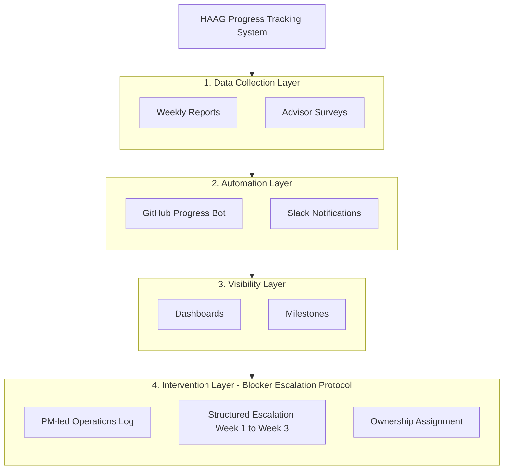
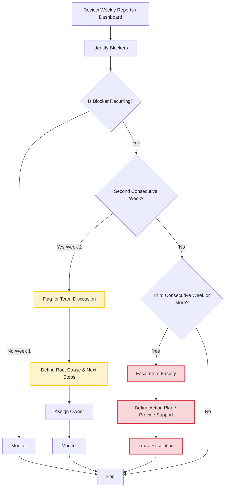

# Structured Blocker Escalation Procedure (HAAG)

## 1. Overview

The **Structured Blocker Escalation Procedure** is a standardized protocol designed to improve the early identification and resolution of blockers within projects under the **Human Augmented Analytics Gruop (HAAG)** initiative.

This procedure was piloted in the **R for Evolution** project, where it demonstrated qualitative improvements in workflow smoothness, accountability, and communication. The protocol is now intended for adoption across all HAAG projects to ensure consistent progress tracking and timely intervention when tasks become stalled.

---

## 2. Purpose

The purpose of this procedure is to:

- Enable early detection of blockers affecting project progress.
- Establish a clear and consistent escalation pathway.
- Clarify roles and responsibilities for blocker resolution.
- Reduce the duration that tasks remain blocked.
- Improve communication and accountability within project teams.
- Provide a scalable framework applicable to all HAAG initiatives.

---

## 3. Scope

This procedure applies to:

- All **HAAG projects**.
- **Project Managers (PMs)** responsible for coordinating project progress.
- **Student researchers** contributing to project deliverables.
- **Faculty advisors** and other stakeholders involved in decision-making or support.

The **R for Evolution** project served as the pilot implementation for this procedure.

---
## 4. Where This Initiative Fits within HAAG Tracking Ecosystem

HAAG Progress Tracking System provides strong visibility into research progress through reports, GitHub tracking, and dashboards. However, it lacked a structured mechanism to intervene when issues persist over time.

This initiative functions as the **Intervention Layer** within the HAAG tracking ecosystem to address the issue of persisting blockers.

---
## 5. Definitions

### 5.1 Blocker
A **blocker** is any impediment that prevents meaningful progress on a task and cannot be resolved by the researcher independently.

**Examples include:**
- Dependency on another team member or stakeholder.
- Lack of access to required data, tools, or resources.
- Need for faculty or stakeholder decisions.
- Technical issues that halt progress.
- Unclear requirements or scope.

**Not considered blockers:**
- Tasks progressing more slowly than expected.
- Routine learning curves or minor challenges.
- Personal time management issues unless they significantly impact project deliverables.

---

## 6. Roles and Responsibilities

### 6.1 Project Manager (PM)
- Owns and implements the escalation procedure.
- Reviews weekly reports and monitors project dashboards.
- Identifies recurring blockers.
- Facilitates Week 2 discussions and assigns ownership.
- Coordinates Week 3 escalations with faculty or relevant stakeholders.
- Maintains the operations log and tracks outcomes.

### 6.2 Student Researchers
- Report blockers promptly in weekly reports and throughout the week.
- Provide sufficient context to enable resolution.
- Engage in discussions to identify root causes and next steps.
- Execute agreed-upon action plans.

### 6.3 Faculty Advisor / Stakeholders
- Provide guidance and decision-making support when blockers are escalated.
- Assist in resolving dependencies, resource constraints, or scope issues.
- Support the PM in implementing intervention strategies.

### 6.4 CLEAR Advisor (Optional)
- May provide technical mentorship when applicable.
- Not responsible for managing the escalation process, which is led by the PM.

---

## 7. Escalation Principles

1. **Timeliness:** Blockers should be surfaced as soon as they arise.
2. **Accountability:** Each escalated blocker must have a clearly assigned owner.
3. **Transparency:** All stakeholders should have visibility into persistent blockers.
4. **Flexibility:** Escalation should consider the nature and severity of the blocker.
5. **Scalability:** The process should remain lightweight and adaptable across projects.

---

## 8. Escalation Workflow

The escalation process follows a time-based, three-stage model:

### Week 1 – Identification and Monitoring
- Researchers report blockers in weekly reports or through ongoing communication channels.
- The PM reviews reports, dashboards, and communication platforms.
- The blocker is documented and monitored.

### Week 2 – Team-Level Escalation
If the blocker persists into a second consecutive week:
- The PM flags the blocker for discussion during the team meeting.
- The root cause is analyzed.
- A concrete resolution plan is defined.
- An **owner** is assigned to drive resolution.
- The blocker and action plan are documented in the operations log.

### Week 3 – Faculty/Leadership Escalation
If the blocker persists into a third consecutive week:
- The PM escalates the issue to the **faculty advisor** or appropriate stakeholder.
- Additional support, resources, or scope adjustments are considered.
- A formal action plan is documented and tracked until resolution.

---

## 9. Escalation Channels by Blocker Type

Different types of blockers may require escalation through specific channels:

| Blocker Type | Example | Escalation Channel |
|--------------|--------|-------------------|
| Technical | Algorithm or implementation challenges | Faculty Advisor / CLEAR Advisor |
| Resource | Lack of data, tools, or infrastructure | PM → Faculty / HAAG Leadership |
| Dependency | Waiting on another researcher or team | PM-mediated coordination |
| Decision | Need for scope or priority clarification | Faculty Advisor |
| Administrative | Access or organizational issues | PM → HAAG Leadership |

---

## 10. Continuous Blocker Reporting

To enable early intervention, researchers are encouraged to surface blockers **throughout the week**, not solely during weekly reports. Recommended communication channels include:

- Slack or Discord project channels.
- Direct messages to the PM.
- Updates to shared dashboards or task management tools.

This proactive approach reduces delays and supports timely resolution.

---

## 11. Documentation and Tracking

The following artifacts support the procedure:

- **Weekly Reports:** Primary source for identifying blockers.
- **Operations Log and Dashboard:** Tracks recurring blockers, escalation actions, and outcomes.
- **Meeting Notes:** Document discussions and assigned action items.

---

## 12. Expected Outcomes

Implementation of this procedure is expected to:

- Reduce the duration and frequency of persistent blockers.
- Improve project momentum and predictability.
- Enhance accountability and communication.
- Provide earlier visibility into risks and dependencies.
- Enable scalable progress tracking across HAAG projects.

---

## 13. Pilot Insights: R for Evolution

The **R for Evolution** project served as the pilot for this procedure. Key qualitative outcomes included:

- Reduction of recurring multi-week blockers.
- Increased accountability through timely weekly report submissions.
- Improved clarity in distinguishing true blockers from slow progress.
- Enhanced communication between researchers, the PM, and faculty.
- Smoother overall project workflow.

Notably, the pilot demonstrated that the **Project Manager** is best positioned to implement this protocol, given their continuous oversight of project progress, while **CLEAR advisors** remain focused on technical mentorship.

---

## 14. Process Flow

The following diagram illustrates the escalation workflow:

1. Review weekly reports / dashboard  
2. Identify blockers  
3. Check if blocker is recurring:  
   - **No →** Monitor  
   - **Yes (Week 2) →** Flag for discussion and define next steps  
   - **Yes (Week 3) →** Escalate for faculty intervention  
4. Track outcome (**resolved / persists**)  

This flow is currently implemented manually through weekly log review and summary reporting.

---

## 15. Scalability Across HAAG

This procedure is intentionally lightweight and tool-agnostic, enabling easy adoption across all HAAG projects regardless of team size or technical domain. Standardizing this approach promotes organizational consistency and supports effective project governance.

---

## 16. Review and Continuous Improvement

The procedure should be reviewed at the end of each semester to:

- Assess effectiveness and identify improvement opportunities.
- Incorporate feedback from PMs, researchers, and faculty.
- Update escalation channels and documentation as needed.

---

## 17. Version Information

- **Version:** 1.0  
- **Pilot Project:** R for Evolution  
- **Organization:** Human Augmented Analytics Group (HAAG)  
- **Owner:** HAAG Project Management Function  
- **Effective Date:** [TBD]

---

## 18. Related Documents

- [Blocker Escalation Implementation Guide](Blocker_Escalation_Implementation_Guide.md)
- [R for Evolution Initiative Pilot Context Document](R_for_Evolution_Initiative_Pilot_Context.md)
