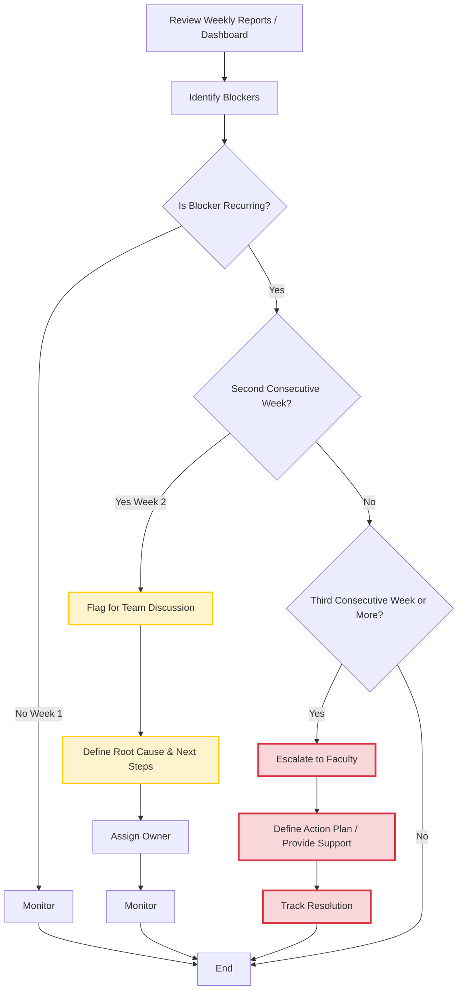

# Midterm Initiative Reflection

## **1. Describe Your Initiative / Procedure**

The initiative introduces a **Structured Blocker Escalation Protocol** to improve how blocked tasks are identified and resolved within the team.

Currently, blockers are reported weekly but may persist without structured follow-up. This procedure adds a lightweight escalation layer on top of existing reporting by introducing time-based triggers:

- **Week 1:** Blocker reported  
- **Week 2:** If recurring → flagged and discussed in team meeting  
- **Week 3:** If still unresolved → escalated for faculty-level intervention  

In practice, this is implemented by reviewing **weekly reports, dashboards, and the operations log** to identify recurring blockers and surface them for escalation.

---

## **2. Hypotheses / KPIs**

### **Hypothesis**
A structured escalation protocol will:
- Reduce the time tasks remain blocked  
- Improve overall project momentum  

### **Currently Observed (Qualitative)**
- Presence of recurring blockers across weeks  
- Delays in resolution due to lack of structured follow-up  
- Increased visibility when blockers are explicitly highlighted  

### **KPIs to Measure (In Progress)**
- Time a blocker persists (**number of weeks**)  
- Frequency of repeated blockers  
- Time to resolution after escalation  

### **Still to Be Measured**
- Comparison of resolution time **before vs. after escalation**  
- Reduction in number of multi-week blockers  
- Impact on overall task completion rate  

---

## **3. Method for Testing (Flowchart)**

The process follows a simple decision flow:

1. Review weekly reports / dashboard  
2. Identify blockers  
3. Check if blocker is recurring:  
   - **No →** Monitor  
   - **Yes (Week 2) →** Flag for discussion and define next steps  
   - **Yes (Week 3) →** Escalate for faculty intervention  
4. Track outcome (**resolved / persists**)  

This flow is currently implemented manually through weekly log review and summary reporting.

---

## **4. Stakeholder Engagement**

Stakeholder engagement is currently **indirect**:

- Researchers report blockers in weekly updates  
- Faculty reviews summaries and responds when issues are surfaced  

Engagement **partially matches expectations**, as blockers are visible but not consistently acted upon unless explicitly highlighted.

This reinforces the need for the initiative, as **visibility alone is insufficient without structured escalation**.

### **Next Steps**
- When escalation should occur  
- Who is responsible for resolving escalated blockers  

---

## **5. Documentation & Sustainability**

### **Documented**
- Escalation protocol and workflow (**GitHub repo**)  
- Blocker tracking integrated into the operations log (**pilot phase**)  
- A repeatable weekly review process  

### **Planned Documentation**
- Standardized escalation guidelines (**Week 2 / Week 3 triggers**)  
- Integration into HAAG tracking workflows  
- Example cases of escalation and resolution  

_Currently hosted within project documentation on GitHub and operations logs. Additional formal documentation will be completed through the initiative final report._

---

## **6. Measuring Progress**

### **Current Indicators (Qualitative)**
- Ability to identify recurring blockers across weeks  
- Increased clarity on which tasks are stalled  
- Improved visibility of dependencies and risks  

### **Early Signs of Success**
- Blockers are being surfaced more explicitly  
- Easier to track stalled work across reports  

### **Challenges**
- Lack of historical structured data for comparison  
- Reliance on manual identification of recurring blockers  

---

## **7. Obstacles & Bottlenecks**

### **Observed Challenges**
- The term **“blocker” lacks a consistent definition**; researchers often use it broadly to label tasks that take longer than expected rather than true impediments  
- No formal mechanism previously existed for tracking recurring blockers  
- Blockers require contextual interpretation (not easily automated)  
- Responsibility for resolving blockers is not always clearly defined  

### **Unexpected Issues**
- Variability in how blockers are reported across team members  
- Some blockers are technical and require longer resolution cycles, making escalation timing less clear  

### **Structural Challenge**
- Absence of a dedicated advisor layer increases reliance on **PM-led escalation and coordination**  
- This is observed in projects that do not have a **clear advisor** (e.g., *R for Evolution*)  
