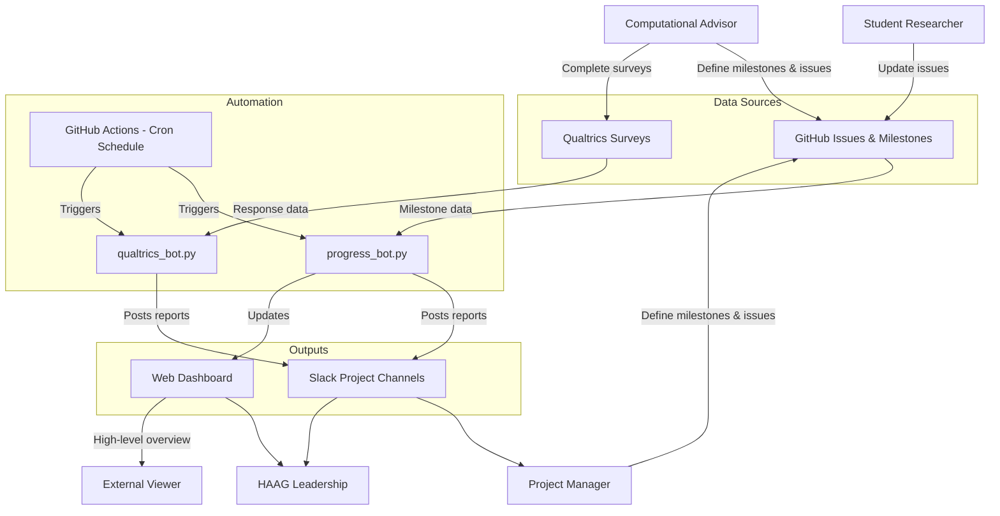

# Progress Bot and GitHub Issue Tracking

## Overview

This document focuses on the automated progress tracking bot that monitors research progression across HAAG projects using GitHub milestones and issues.

---

## Automated Progress Tracking Bot

The HAAG tracking ecosystem utilizes an automation bot from the [Progress-Tracker](https://github.com/Human-Augment-Analytics/Progress-Tracker/) repository to monitor research progression across HAAG projects. 

This bot provides unified and automated visibility into technical objectives by:

* Tracking **GitHub milestones** to measure high-level research project progress across the group
* Tracing **GitHub issues** to monitor individual task completion and progress
* Running via **GitHub Actions on a cron schedule** to automatically fetch metrics, requiring no dedicated server or maintenance overhead

Metrics are available via the centralized [HAAG Project Tracker dashboard](https://human-augment-analytics.github.io/Progress-Tracker/), and the bot can report updates directly into project-specific Slack channels, complementing weekly student reports.

---

## Use Cases

**For HAAG Leadership:**

* Maintain high-level view of all ongoing HAAG initiatives without micromanaging individual teams
* Identify bottlenecks and assess resource allocation
* Ensure technical objectives align with overarching research goals before weekly advisor check-ins

**For Project Managers:**

* Track individual team progress at a granular level
* Collaborate with Computational Advisors to establish project roadmaps
* Define GitHub milestones and issues tied directly to weekly deliverables
* Provide objective metrics for evaluating researcher progress

---

## Roles and Responsibilities

| Role               | Responsibility                                                                                       |
| ------------------ | ---------------------------------------------------------------------------------------------------- |
| Student            | Update assigned GitHub issues                                                                         |
| Project Manager    | Track individual team progress, map tasks to code, and define roadmaps with Computational Advisors |
| HAAG Leadership    | Maintain high-level view via dashboard, allocate resources, and intervene                            |
| System             | Send automated notifications                                                                         |

---

## System Architecture Overview

The system is implemented in the [Progress-Tracker](https://github.com/Human-Augment-Analytics/Progress-Tracker/) repository with the following components:

| Component | File | Description |
|-----------|------|-------------|
| Progress Bot | `progress_bot.py` | Tracks GitHub milestones and sends reports to Slack |
| Qualtrics Bot | `qualtrics_bot.py` | Tracks survey response rates via Qualtrics OAuth2 API |
| Combined Bot | `advanced_progress_bot.py` | Runs both progress and survey tracking in a single report |
| Web Dashboard | `docs/index.html` | Centralized [project tracker dashboard](https://human-augment-analytics.github.io/Progress-Tracker/) |
| GitHub Actions | `.github/workflows/` | Cron-scheduled workflows that run the bots automatically |

