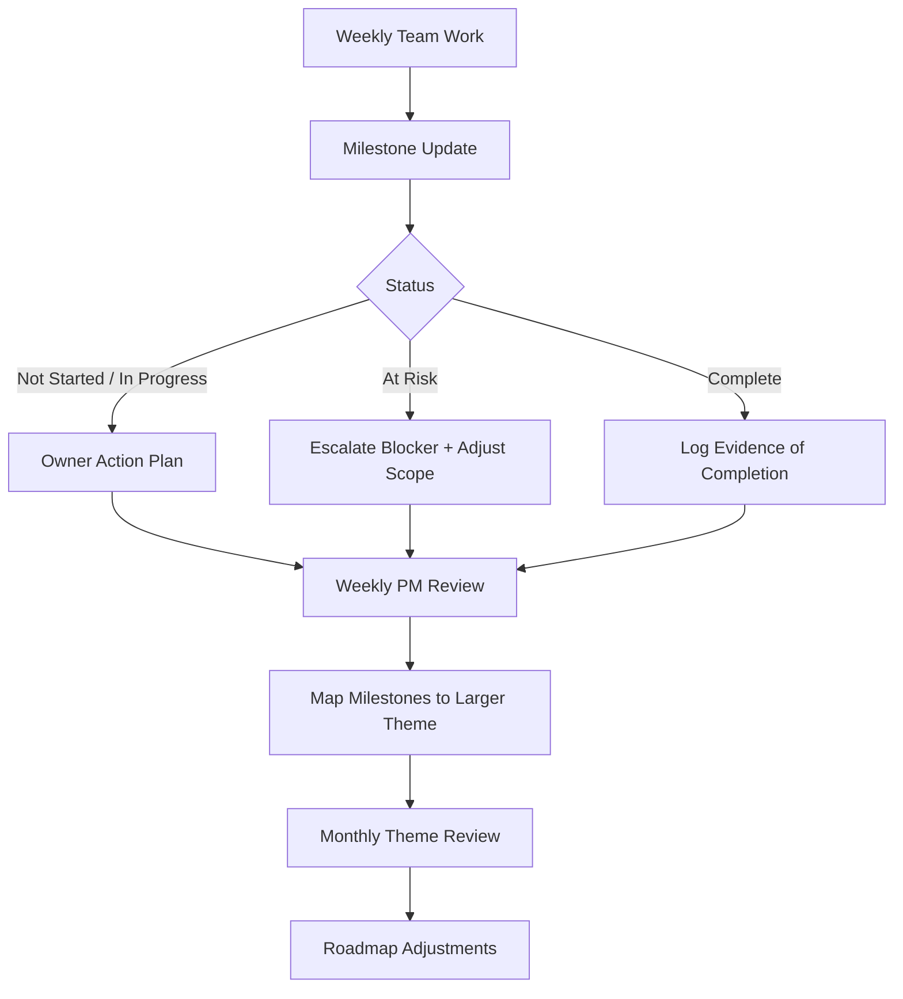

# Midterm Initiative Reflection: Milestones and Larger Themes

## Initiative Summary

This initiative introduces a lightweight planning and tracking structure with two layers:

* Milestones: short-term, concrete deliverables with owners and due windows
* Larger Themes: longer-term strategic goals that connect related milestones across teams

The objective is to make weekly execution easier to interpret while keeping long-term direction visible.

---

## Discovery Snapshot

Midterm discovery focused on current reporting and planning behavior:

* Teams report activity weekly, but progress is spread across channels and tools.
* Milestone language and status definitions vary across projects.
* Strategic themes are discussed, but not always written in a reusable format.
* PMs can see updates, but cross-project alignment requires manual interpretation.

---

## What I Completed So Far

* Defined a standard milestone record with: title, owner, status, due date, dependency, completion criteria.
* Defined a standard theme record with: focus area, problem statement, related milestones, success indicators.
* Created and documented the shared folder and usage guidance in the repository.
* Drafted a repeatable weekly update sequence and monthly review cadence.

---

## Visual Representation of Proposal

---

## What Is Working

* The two-layer model is easy to explain and adopt.
* Milestone ownership improves accountability during weekly check-ins.
* Theme mapping helps explain why specific tasks matter.
* The process can run in existing tools without additional platforms.

---

## Challenges Observed

* Teams still interpret status labels inconsistently without strict definitions.
* Some updates are descriptive but missing objective completion evidence.
* Theme progress remains harder to quantify than milestone completion.
* Cadence can slip when no explicit monthly checkpoint is scheduled.

---

## Midterm Learning and Evidence

* Simplicity drives adoption, but simplicity alone does not guarantee consistency.
* Clear owner + due date is the minimum requirement for usable milestone tracking.
* Teams provide better updates when examples of acceptable evidence are shown.
* Monthly synthesis is necessary to keep strategic themes active, not passive.

---

## Pilot Plan for Second Half

1. Baseline (2 weeks)
* Observe current milestone update quality and consistency.
* Record missing fields, ambiguous statuses, and escalation delays.

2. Protocol Introduction (3 weeks)
* Roll out standardized milestone and theme fields.
* Apply shared status definitions and owner requirements.
* Run weekly PM review and one monthly theme review.

3. Compare and Iterate (1 week)
* Compare baseline and post-protocol quality.
* Capture PM/advisor feedback and adjust template language.

---

## Measurement Criteria

| Metric | Baseline Target | Post-Protocol Target |
| --- | --- | --- |
| Milestones with assigned owner | < 80% | >= 95% |
| Milestones with valid status | < 75% | >= 95% |
| Milestones with clear completion evidence | < 60% | >= 85% |
| Themes with monthly review note | ad hoc | 100% |
| PM-reported clarity (1-5) | <= 3.5 | >= 4.0 |

---

## Adjustments Already Planned

* Publish strict status definitions: Not Started, In Progress, At Risk, Complete.
* Require one accountable owner for every milestone.
* Require one evidence field for completed milestones.
* Keep entries brief to avoid documentation fatigue.
* Run one fixed monthly theme review checkpoint.

---

## Expected End-of-Term Outcome

By the end of the term, this initiative should provide:

* Consistent milestone records across projects
* Faster identification of at-risk work
* Clear mapping between weekly execution and strategic themes
* Better PM and leadership visibility for planning decisions
