# HAAG Website Documentation, Governance Procedure, and Improvement Proposal

**Human-Augmented Analytics Group (HAAG)**  
Website: [https://sites.gatech.edu/human-augmented-analytics-group/](https://sites.gatech.edu/human-augmented-analytics-group/)

---

# 1. Purpose of This Document

This document:

1. Records the historical usage of the HAAG website.
2. Identifies structural and operational challenges.
3. Converts current observations into a proposed maintenance procedure.
4. Recommends a GitHub-first governance model to reduce admin burden.
5. Outlines where automation can replace repeated manual website updates.

This proposal is intended to support long-term sustainability, transparency, and visibility of HAAG's work.

---

# 2. Intended Audience and Scope

This document is written as a procedure for the people who would actually use or maintain the website workflow.

**Primary audience**

* HAAG admins or website stewards responsible for approving or auditing public website updates

**Secondary audience**

* Project leads maintaining public-facing project information
* Researchers contributing to project documentation
* Faculty, computational advisors, or researchers proposing events, seminars, or community-facing content

**Tertiary audience**

* Publications stewards
* Program leads maintaining stable program information
* Collaborators working on related GitHub and overview automation efforts

This procedure covers three content categories:

1. Project updates and project discovery
2. Community engagement content such as seminars, events, blogs, and external-facing announcements
3. Stable website information such as front page messaging, program pages, publications, and contact pathways

---

# 3. Platform Overview

HAAG uses the **Georgia Tech WordPress platform** for all public-facing websites.

Historically, website maintenance responsibilities were distributed across designated roles:

* **Website Manager** (project-level pages)
* **Unit Meeting Manager** (unit-level pages)

Neither role is currently active.

---

# 4. Historical Website Usage

## 4.1 Community Blog Page

**Purpose:** Highlight team milestones, achievements, and events  
**First Used:** May 19, 2024  
**Last Updated:** June 8, 2025

Status: Not regularly maintained.

Challenge:

* No standardized update collection process
* No defined posting cadence
* No assigned content owner

---

## 4.2 Prospective Collaborator Page

**Published:** May 2024

Purpose: Engage potential collaborators.

Status: Incomplete and unfinished.

---

## 4.3 Role-Specific Pages

Created pages for:

* Faculty & Postdoctoral Fellows
* Community Expert Affiliates
* Student Researchers
* Leadership

Example:  
[https://sites.gatech.edu/human-augmented-analytics-group/faculty-affiliates-for-transdisciplinary-expansion-fate-program/](https://sites.gatech.edu/human-augmented-analytics-group/faculty-affiliates-for-transdisciplinary-expansion-fate-program/)

Status: Defunct.  
No active update mechanism exists.

---

## 4.4 External Contact System

Intent: Create streamlined external contact intake through website.

Status: Never implemented.

---

## 4.5 Community Events Page

Purpose: Display planned events.

Status: Not updated since first semester.  
No defined process for adding new events.

---

## 4.6 Seminars Page

Active: Fall 2024  
Example:  
[https://sites.gatech.edu/human-augmented-analytics-group/2025/06/08/haag-biotech-training-seminar/](https://sites.gatech.edu/human-augmented-analytics-group/2025/06/08/haag-biotech-training-seminar/)

Status: Not updated since Fall 2024.

---

## 4.7 Front Page

Purpose: Reflect current organizational goals.

Status:

* Recently updated
* Organizational layout identified as improvement opportunity

---

## 4.8 Publications Tab

Purpose: List group publications.

Status:

* Out of date
* Does not reflect full group output

---

## 4.9 Project Pages - Ongoing Projects

Multiple attempts to organize projects:

* Separate project tabs
* Domain-based structure (Social / Tech / Biotech - Summer 2025)
* Unit-based pages

All attempts lacked long-term maintenance sustainability.

Domain model was abandoned due to:

* New projects emerging outside predefined categories
* Taxonomy rigidity

---

## 4.10 Individual Program Pages

Pages exist for:

* Management Class
* Comp Advisor Program
* Faculty Affiliates Program
* Researchers Program

These pages document structure and purpose but lack systematic updating.

---

## 4.11 Unit Pages - Summer 2025

Example:  
[https://sites.gatech.edu/human-augmented-analytics-group/3d-modeling-unit/](https://sites.gatech.edu/human-augmented-analytics-group/3d-modeling-unit/)

Researchers were instructed to create and maintain unit-level pages.

Status:

* Not consistently maintained
* Unit Meeting Manager oversight was unsustained

---

# 5. Core Challenges Identified

Across all website iterations, the primary barriers were:

## 5.1 Maintenance Burden

Researchers prioritize research outputs over website updates.

## 5.2 Role Sustainability Failure

Website Manager and Unit Meeting Manager roles were:

* Time-intensive
* High friction
* Not incentive-aligned

## 5.3 Content Duplication

Parallel content required:

* GitHub updates
* WordPress updates
* Slides
* Internal documentation

This duplication caused decay.

## 5.4 Structural Rigidity

Category-based organization (for example Social/Tech/Biotech) did not scale.

---

# 6. Lessons Learned

1. Website updates must integrate into existing workflows.
2. Manual parallel updates are unsustainable.
3. Governance roles must be lightweight.
4. Content pipelines must be automated where possible.
5. The public website should aggregate, not duplicate.

---

# 7. Proposed Governance Principle

## 7.1 Make WordPress a Portal Layer

Instead of hosting full project documentation in WordPress:

WordPress becomes:

* Overview hub
* Public-facing narrative layer
* Entry point to GitHub repositories
* Place for stable, curated information

GitHub becomes:

* Source of truth
* Actively maintained project documentation space
* Intake point for structured updates
* Foundation for future automation

## 7.2 Shift Requirements to the Project-Level GitHub Structure

Rather than requiring each project to maintain a separate WordPress page, HAAG should standardize what must exist in each project's GitHub repository.

At minimum, each active project repository should contain a required `README` with:

* Project title
* Short public summary
* Current status
* Lead or maintainer
* Associated unit or program, if applicable
* Key tags or research areas
* Last meaningful update date
* Link to outputs such as demos, papers, or publications when available
* Link or pointer to any active milestones, issues, or documentation

This keeps updates inside the tool researchers already use and creates a reusable structure for the website to reference.

---

# 8. Website Content Ownership Model

## 8.1 Project Updates

**Owner:** Project lead  
**Support:** Researchers contributing to the repository  
**Admin role:** Approve linking and verify completeness, not rewrite project content

Project information should live primarily in GitHub and be surfaced on the website through a lightweight projects hub.

## 8.2 Community Engagement Content

This includes:

* Seminars
* Events
* Community blog posts
* External-facing announcements

**Owner:** Event proposer or content proposer  
**Admin role:** Approve scope and ensure consistency  
**Goal:** Push setup and content ownership to the person proposing the item, while keeping admin work focused on approval and publication

## 8.3 Stable Website Information

This includes:

* Front page messaging
* Program pages
* Contact page
* Publications page
* Role-specific or organization-specific reference pages

**Owner:** Admin, publications steward, or relevant program lead  
**Cadence:** Update only when organizational information changes or on a semester audit cycle

---

# 9. Proposed Procedure

## 9.1 Procedure A: Publishing and Maintaining Project Information

This procedure applies when a project should appear on the public website or when an existing project's public information needs to stay current.

### Step-by-step flow

1. A project lead creates or updates the project's GitHub repository.
2. The lead ensures the repository `README` follows the required public-facing structure.
3. The lead includes project status, maintainers, tags, and links to meaningful outputs.
4. The lead submits the project for website visibility through a lightweight GitHub-based intake process, such as a central issue, pull request, or tracked request.
5. Admin reviews whether the repository is complete enough for public linking.
6. If incomplete, the project lead updates the repository and resubmits.
7. If approved, the WordPress site links to the repository through a project hub or summary card.
8. While the project is active, the team updates GitHub rather than maintaining duplicate WordPress text.
9. When the project is closed, the repository should include any publication or final output link.
10. Closed projects can then feed the publications page, archive page, or both.

### Result

The website stays lightweight, while researchers maintain only one authoritative public source.

## 9.2 Procedure B: Advertising Seminars, Events, and Community Content

This procedure applies when a faculty member, computational advisor, or researcher wants HAAG to advertise or host a community-facing item.

### Step-by-step flow

1. The proposer submits the item through a standardized GitHub-based intake mechanism or equivalent structured request.
2. The submission includes the required fields, such as title, host, date, audience, short description, registration or meeting link, and any approval-sensitive details.
3. Admin reviews whether the item fits HAAG scope and is complete enough for publication.
4. If the submission is incomplete or out of scope, it is returned for revision or declined.
5. If approved, the proposer remains responsible for the underlying event setup, such as speaker coordination, Teams setup, registration details, or materials.
6. Admin or automation publishes the approved item to the website and, where appropriate, other channels.
7. After the event or announcement, the proposer can add follow-up materials such as slides, recording links, recap text, or related repository links.
8. The item is then archived or moved off the active page as appropriate.

### Result

This keeps one-off event work with the person proposing the event and reduces admin effort to approval and consistency checks.

## 9.3 Procedure C: Maintaining Stable Pages and General Information

This procedure applies to information that should remain public and consistent but does not need frequent edits.

### Step-by-step flow

1. A program lead, admin, or designated owner identifies a needed update to stable website information.
2. The owner reviews whether the content is genuinely website-owned or whether it should instead point to GitHub or another maintained source.
3. If the content belongs on the stable website layer, admin updates the relevant WordPress page.
4. Stable pages are reviewed during a semester audit to remove stale references and confirm that links still work.
5. Publications are updated when project repositories clearly indicate closure and include publication links or output references.

### Result

Stable information remains curated, while changing project content stays outside WordPress.

---

# 10. Recommended GitHub Integration Model

## Option A - Direct Repository Linking (Low Effort)

Each project entry contains:

* Short description
* Repository link
* Maintainer(s)
* Status badge
* Latest update date

Pros:

* Very simple
* Low overhead
* Sustainable

## Option B - Semi-Automated Sync (Moderate Effort)

Use:

* GitHub `README` rendering
* GitHub badges
* Embedded repository activity
* GitHub Pages, if useful
* Standardized issue or PR templates for website intake

Pros:

* More automation
* Reduced duplication
* Better consistency across projects and events

## Option C - Fully Automated Pipeline (Advanced)

Potential:

* GitHub Actions that generate website-ready summary data
* Static export feeding WordPress
* Publications auto-synced from a central tracker repository
* Automation that routes approved events to website and social channels

Requires technical infrastructure investment.

---

# 11. Governance Redesign

## 11.1 Eliminate Dedicated Website Manager as a Heavy Maintenance Role

Replace with:

### Project Lead Responsibility

Each project lead ensures:

* Repository `README` is current
* Required metadata is present
* Publication or output links are added when applicable

### Event Proposer Responsibility

Each proposer ensures:

* Event submission is complete
* Logistics are owned by the proposer
* Follow-up materials are provided if the item remains public after the event

### Admin or Steward Responsibility

Admins or designated stewards ensure:

* Intake requests are approved or returned
* Stable pages remain accurate
* Links remain valid
* Semester audits occur

## 11.2 Semester or Quarterly Website Audit

Once per semester, or at minimum quarterly:

* Review project links
* Remove stale or duplicate pages
* Confirm active repositories still exist
* Move closed projects into publications or archive pathways
* Check seminars, events, and stable pages for outdated information

This is intended to be a lightweight governance action, not a continuous manual editing role.

---

# 12. Content Update Simplification Strategy

| Current Model                | Proposed Model                                  |
| ---------------------------- | ----------------------------------------------- |
| Researchers update WordPress | Researchers update GitHub                       |
| Managers manually edit pages | WordPress references GitHub                     |
| Multiple page categories     | Fewer, flatter pages with flexible tags         |
| Event setup falls to admins  | Event proposer owns setup; admin approves       |
| Publications updated ad hoc  | Closed project status feeds publication updates |
| High maintenance             | Lower maintenance with automation opportunities |

---

# 13. Specific Improvement Recommendations

## 13.1 Front Page Redesign

* Clear mission statement
* 3 to 5 featured active projects
* Latest publication highlight
* Upcoming seminar or event highlight
* Direct GitHub button

## 13.2 Publications Page Fix

* Maintain a single publication tracker or repository reference
* Require closed project repositories to include publication links when available
* Update WordPress on a semester cadence or automate later
* Assign a publications steward if needed

## 13.3 Replace Project Taxonomy with Flexible Tags

Instead of rigid domains:

* Use tags such as AI, Biotech, Social Systems, Policy, Modeling, or Education
* Allow projects to span multiple tags

## 13.4 External Contact Page Implementation

Add:

* Simple intake form
* Direct contact email
* Research interest dropdown

## 13.5 Archive System

Add an "Archived Projects" section linking to historical repositories and final outputs.

## 13.6 Community Engagement Workflow

Create one consistent procedure for:

* Seminars
* Events
* Community blog items
* Other non-project public announcements

This should minimize admin setup work and maximize proposer ownership.

---

# 14. Implementation Roadmap

## Phase 1 (Immediate - 2 Weeks)

* Preserve current website structure while documenting the new procedure
* Define required project repository `README` structure
* Define a GitHub-based intake method for new project links and community content
* Audit active projects and identify which public pages can be replaced with repository links

## Phase 2 (1 Semester)

* Pilot project-level GitHub standards with active projects
* Pilot the event and seminar intake procedure
* Reduce duplicate WordPress project content
* Rebuild publications tracking around project closure and output links
* Clarify which stable pages remain website-owned

## Phase 3 (Optional Advanced)

* Explore automation through GitHub Actions
* Generate website-ready project summaries from repository metadata
* Explore automated event and publication feeds
* Connect with related work on high-level overview and GitHub update visibility

---

# 15. Success Metrics

The website system is successful if:

* Projects are discoverable.
* Updates reflect current research.
* Event publication is possible without major admin intervention.
* Maintenance takes less than 1 hour per month outside of audit windows.
* No role becomes overloaded.
* Researchers are not duplicating work across GitHub and WordPress.
* Stable pages remain accurate at semester review points.

---

# 16. Proposed Initiative Alignment

A fitting initiative title for this work is:

**GitHub-First Website Automation and Content Governance Initiative**

This initiative sits between website strategy and operational procedure. It is especially aligned to:

* standardizing project-level GitHub structures
* defining how community events and seminars are submitted and published
* clarifying which information belongs on the website versus in GitHub
* reducing admin burden through automation and lightweight approval flows

This also creates a natural collaboration point with related work on project overviews, GitHub update visibility, and automated summary generation.

---

# 17. Conclusion

The historical HAAG website model relied on manual updates and designated roles that proved unsustainable.

The proposed redesign:

* simplifies maintenance
* aligns updates with researcher workflows
* leverages GitHub as the active source of truth
* reduces duplication
* improves long-term sustainability

By repositioning WordPress as a lightweight portal layer and GitHub as the documentation backbone, HAAG can improve visibility without shifting continuous maintenance work onto admins.

---

## Procedure flow diagram

```mermaid
flowchart TD

  subgraph A[Procedure A - Project Updates]
    A1[Project needs public visibility] --> A2[Project lead updates required GitHub README and metadata]
    A2 --> A3{Repository complete enough for public use?}
    A3 -- No --> A4[Lead revises repo structure and content]
    A4 --> A2
    A3 -- Yes --> A5[Submit GitHub-based website intake request]
    A5 --> A6[Admin reviews scope, links, and completeness]
    A6 --> A7{Approved?}
    A7 -- No --> A8[Return feedback to project lead]
    A8 --> A2
    A7 -- Yes --> A9[WordPress project hub links to repo or summary card]
    A9 --> A10{Project still active?}
    A10 -- Yes --> A11[Researchers keep GitHub updated]
    A11 --> A9
    A10 -- No --> A12[Lead marks project closed and adds publication/output links]
    A12 --> A13[Archive or publications page updated]
  end

  subgraph B[Procedure B - Events, Seminars, and Community Content]
    B1[Faculty, advisor, or researcher wants to advertise an item] --> B2[Submit standardized GitHub-based request]
    B2 --> B3[Admin reviews scope and required details]
    B3 --> B4{Approved?}
    B4 -- No --> B5[Requester revises or withdraws]
    B5 --> B2
    B4 -- Yes --> B6[Requester owns event setup and materials]
    B6 --> B7[Admin or automation publishes to website and channels]
    B7 --> B8[Post-event recap, slides, or recording added if needed]
    B8 --> B9[Item archived after use]
  end

  subgraph C[Procedure C - Stable Website Information]
    C1[Front page, program, contact, or publication update needed] --> C2[Owner checks whether content belongs on website or in GitHub]
    C2 --> C3{Stable website content?}
    C3 -- No --> C4[Point users to GitHub or maintained source instead]
    C3 -- Yes --> C5[Admin or program owner updates WordPress]
    C5 --> C6[Semester or quarterly audit checks accuracy and stale links]
  end
```

