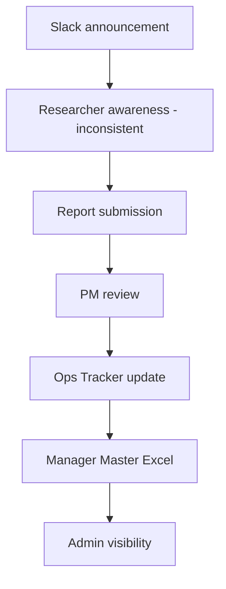
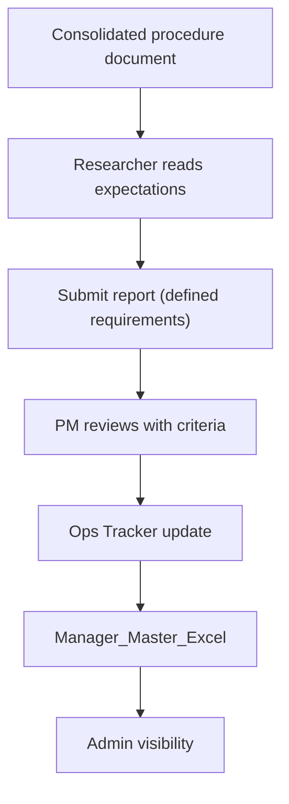

# Initiative Mid-Semester Report  
**Title:** Weekly Reporting Workflow Clarification Initiative  

---

## Describe your initiative / procedure

This initiative focuses on clarifying the existing weekly reporting workflow within HAAG by consolidating it into a single procedural reference.

The reporting system already exists and includes the following steps:

1. Researchers submit weekly reports to their project Slack channel by Friday at 5PM ET.
2. The Project Manager (PM) reviews submissions.
3. The PM synthesizes report content into the Operations Tracker.
4. Tracker data is surfaced in the Manager_Master_Excel file.
5. Administrative leadership references this file for organizational visibility.

While each of these steps occurs in practice, the full workflow and responsibility chain are not documented in one place and instead these expectations are distributed across Slack announcements and informal communication.

This initiative introduces a consolidated clarification protocol that:
- Defines submission expectations and location
- Explains PM responsibilities for tracking
- Clarifies how reports translate into administrative visibility
- Documents how missing reports are handled

Therefore, the goal of the project is tto make the existing process explicit.

---

## Explain the hypotheses / KPIs you have measured at this time and what is left to be measured

**Hypothesis:**

If the weekly reporting workflow is consolidated into a singleular explicit procedural reference then researchers will demonstrate improved understanding of the process and more consistent adherence to reporting expectations.

**KPIs:**

1. **Reporting Adherence**
   - On-time submission
   - Submission in correct Slack channel
   - Inclusion of proof-of-work elements

2. **Procedural Understanding**
   - Measured through a single survey question (1–5 scale)

**What has been observed so far:**

- One researcher (Researcher A) initially did not submit reports due to lack of awareness of the requirement.
- After the reporting process was verbally clarified in a meeting, submissions became consistent and correctly formatted.
- Another researcher (Researcher B) has not participated in reporting, meetings, or Slack communication.

At this stage, only baseline observations have been collected.

---

## Explain your method for testing these hypotheses via flowcharts

### Current Workflow

### Clarified Workflow

---

## Explain how stakeholders are engaging with your initiative

Stakeholder engagement has varied significantly:

- **Researchers**
  - Researcher A became fully compliant after expectations were clarified.
  - Researcher B has remained inactive despite outreach and reminders.
  
- **Computational Advisor**
  - Assigns tasks verbally during meetings.
  - Does not directly engage with reporting submission.

- **PM**
  - Interprets reports and maintains the tracker.
  - Compensates for missing data through assumed status.

Observed engagement does not fully match initial expectations. The process relies heavily on individual awareness rather than structured onboarding or reinforcement.

This variability supports the need for clearer procedural documentation.

---

## What processes have you documented or begun documenting to ensure sustainability of your initiative?

The primary documentation created is:

- The Weekly Reporting Workflow Clarification document developed as part of this initiative

This document is available here:  
[Weekly Reporting Workflow Clarification](https://github.com/Human-Augment-Analytics/admin-project-tracking/blob/main/future_work_and_initiatives/weekly_reporting_workflow_clarification.md)

This document consolidates:
- The full reporting sequence from submission to administrative visibility
- Responsibility definitions across researchers, PMs, and admin-level review
- Handling of missing reports
- Clarification of how reporting expectations are operationalized in practice

Additional documentation planned:
- Refinement of the clarification document based on observations during the testing phase

---

## How are you currently measuring progress toward your goals?

Progress is currently measured through:

- Observation of submission behavior (on-time, completeness, etc.)
- Consistency of reporting across the semester
- Changes in behavior after clarification (e.g., Researcher A's shift from non-submission to consistent submission)

---

## What obstacles or bottlenecks have you encountered?

**Observed challenges:**

- **Small sample size**
  - It is not possible to draw any meaningful conclusions about the initiative at this stage due to the project only having one conistently active researcher.

- **Non-participation**
  - One researcher (Researcher B has remained inactive despite repeated outreach.

- **Informal structure**
  - Task assignment and expectations are communicated verbally.

---

## Which anticipated challenges have materialized, and what unexpected issues have arisen?

**Anticipated:**
- Inconsistent reporting compliance
- Ambiguity in expectations

**Unexpected:**
- Complete non-participation from a team member.
- Strong improvement in compliance after simple verbal clarification.
